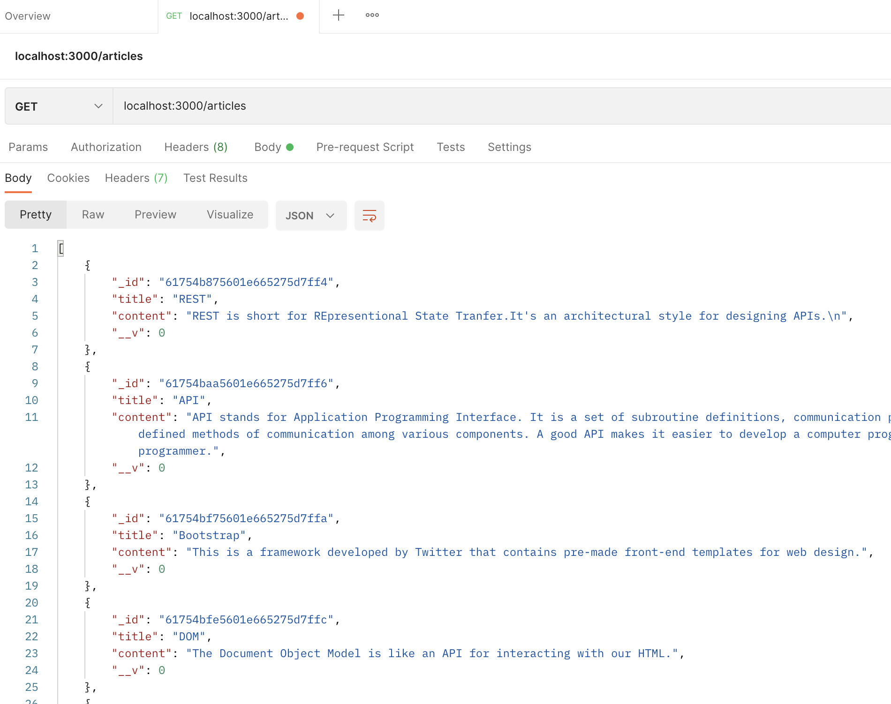
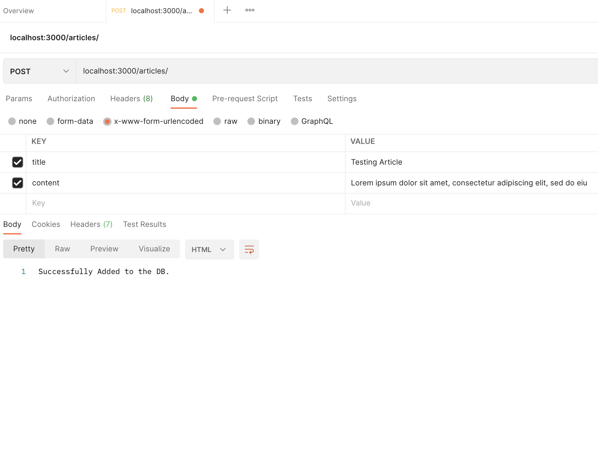

## RESTful API Customise

> This RESTful API made from scratch using MongoDB Postman and Node to CRUD.

> Clone the Repo & npm i.

> Start your MonGOD 😅

> nodemon run and start adding and editing thing by simply going localhost:3000/articles/

> 

> 
