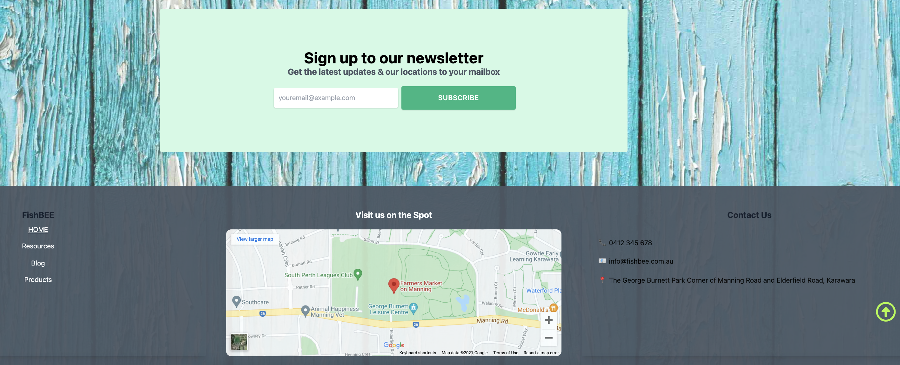

# Profiterol Porfolio App

### FishBEE is currently operating their business at the Manning Farmers Market. They are extremely passionate about our Australian Native Bees. We would like to help them by spreading the word out using the power of the web. They make native bee hotels for people who carry the same value about native bees. We managed to get the prototype they wanted from us. Which are colorful but still professional looking pages.  

### Only challenge we had was that they didn't have any interaction with IT or computers so we made it a super user-friendly WordPress website. We taught them how to use it. We are working on final touch up but you may welcome to visit the live-preview responsive prototype page by visiting. 

