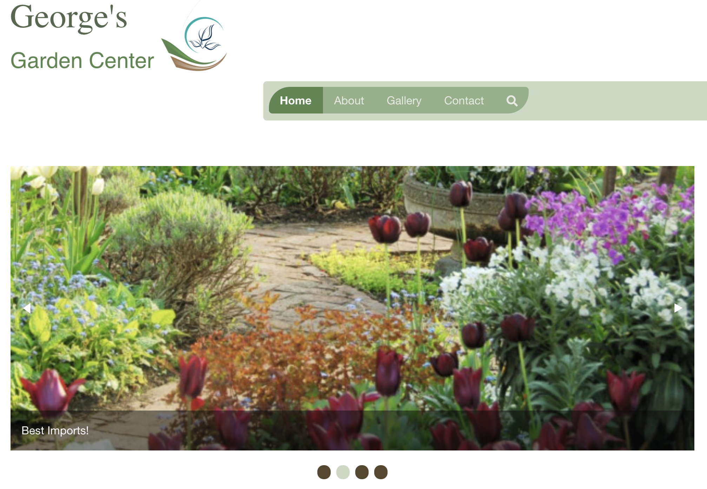
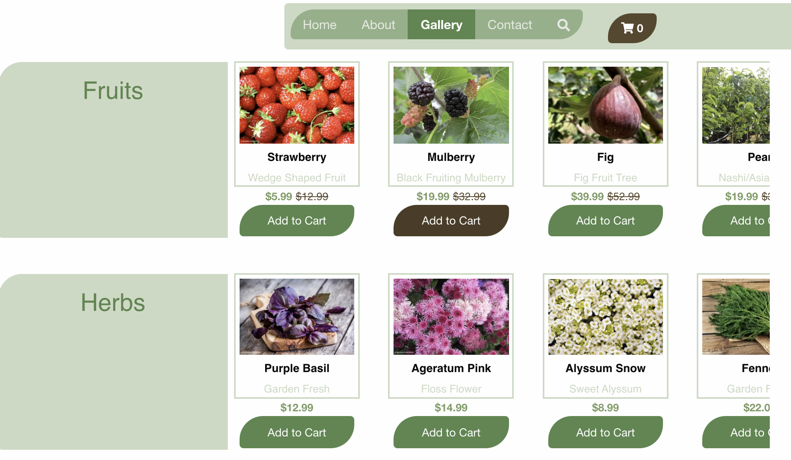
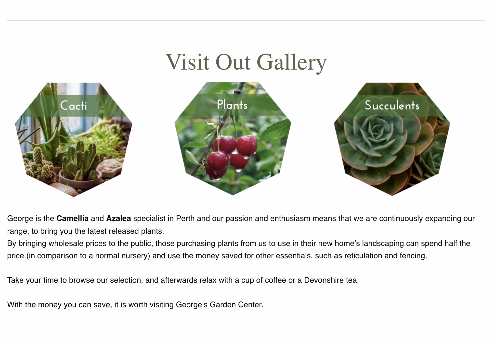
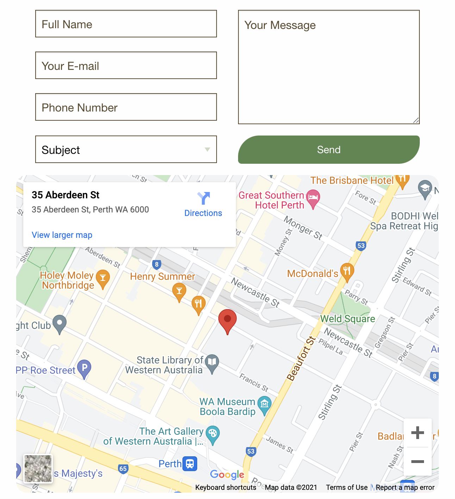

# George's Garden Center

### George's Garden Center is one of the fun practical projects during my studies. This project is about combining a few skills that we gain during our studies. Which is Tailwind, customised SCSS, JS, Pre-Designing. I had some extra time to work on it so I have implemented some animations with SCSS & JS. So feel free to preview the responsive garden website at

